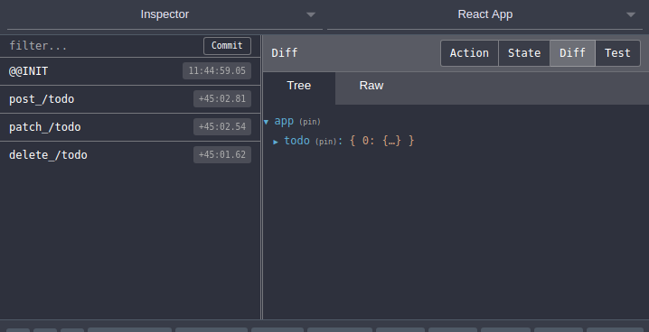

# Domex Redux

Abstraction over redux's actions and reducers using domex. Edit
Add topics. Write less repeative codes and be more productive.

# Usage

Initial Setup
[Example](https://github.com/samundrak/domex-domex-redux-demo)

```
    // root file (index.js)
    import { Router, Domex } from 'domex';
    import DomexRedux from 'domex-redux';

    const router = new Router();
    const domex = new Domex();
    domex.addRouter(router);

    router
        .post(
        '/todo',
        async req => {
            // Do some network task
            return {};
        },
        async (req, res) => {
            // transform payload, normalize, filter or sanitze data here
            return {};
        },
        async (req, res) => {
            // return this final state which can be used by reducer
            // we can get state on req.state
            return { todo: [req.body.item].concat(req.state.app.todo) };
        },
        )
        .patch('/todo', async req => {
        const todo = [].concat(req.state.app.todo);
        todo[req.body.index].value = req.body.value;
        return { todo };
        })
        .delete('/todo', async req => {
        const todo = [].concat(req.state.app.todo);
        todo.splice(req.body.index, 1);
        return { todo };
        });

    const domexRedux = new DomexRedux(domex);
    domexRedux.enableDevtool();
    const store = domexRedux.createStore({
     todo: [],
    });

    ReactDOM.render(
        <Provider store={store}>
            <App domex={domex} />
        </Provider>,
        document.getElementById('root'),
    );
```

Now we can trigger routes.

```
  // App.js
  handleTodoItemUpdate = index => {
    return event => {
      this.props.domex.resource.patch('/todo', {
        data: { value: event.target.value, index },
      });
    };
  };

  handleTodoItemDelete = index => {
    return () => {
      this.props.domex.resource.delete('/todo', {
        data: { index },
      });
    };
  };
  handleNewTodoChange = event => {
    this.setState({
      currentTodo: event.target.value,
    });
  };
  handleAddTodo = () => {
    this.props.domex.resource.post('/todo', {
      data: { item: { id: Date.now(), value: this.state.currentTodo } },
    });
    this.setState({
      currentTodo: '',
    });
  };
}
```

##### Redux devtool


